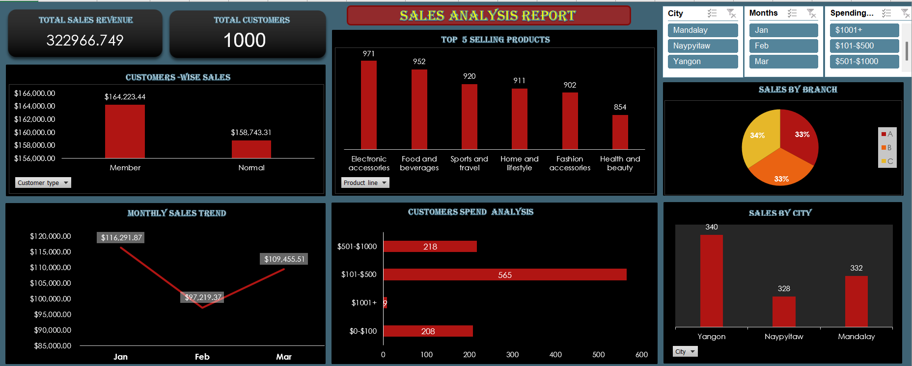

# Sales Analysis Dashboard | Excel

An interactive Excel dashboard designed to analyze sales transactions, customer behavior, product performance, and branch-level revenue for a multinational company.

## 📊 Dashboard Preview

## 🎯 Project Objective

The objective of this project is to turn sales transaction data into useful business insights through a dynamic dashboard. It is designed to help stakeholders understand revenue trends, identify top-selling product lines, review customer spending, and compare branch performance.

## 🗂️ Dataset Overview

The dataset contains sales transaction information with the following fields:

- **Invoice ID** — Unique identifier for each invoice or transaction
- **BranchCity** — City where the branch or store is located
- **Customer type** — Customer category, such as Member or Normal
- **Gender** — Customer gender
- **Product line** — Product category
- **Unit price** — Price per unit
- **Quantity** — Number of units purchased
- **Total** — Total transaction value
- **Date** — Transaction date
- **Payment** — Payment method
- **Rating** — Customer satisfaction rating for the transaction

## 📈 Dashboard Analysis

The dashboard is intended to present these key views:

1. **Total Sales Revenue** — Overall revenue calculated from the `Total` field.
2. **Monthly Sales Trend** — Monthly revenue over the available period.
3. **Top-Selling Product Lines** — Top five product lines by total quantity sold, shown with quantities.
4. **Customer Spending Analysis** — Customer distribution across spending ranges, such as $0–$100, $101–$500, and $501–$1,000.
5. **Sales by Branch** — Revenue comparison across branches, represented in a pie chart.
6. **Sales by Customer Type** — Total revenue summarized for each customer type using a PivotTable.

## 🛠️ Tools & Techniques

- Microsoft Excel
- PivotTables and PivotCharts
- Data aggregation and sales analysis
- Dashboard visualization and business reporting

## 💡 Business Value

This analysis can help users:

- Monitor overall revenue and monthly performance.
- Identify product lines contributing the most sales volume.
- Understand customer spending patterns.
- Compare revenue across branches.
- Compare sales from different customer types.

## 👤 Author

**Dharmdev Yadav**  
Aspiring Data Analyst
